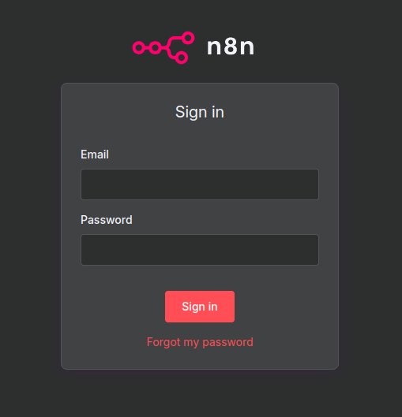
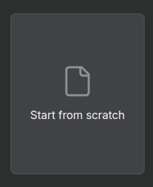
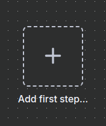
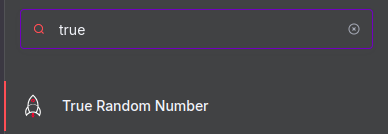
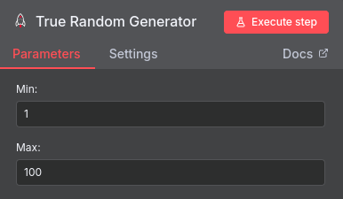

# True Random Number Generator

Este projeto tem como base a criação de um **conector** para o <a href="n8n.io">n8n</a>, uma plataforma de automação que conta com o uso de inteligencia artificial. O objetivo deste conector é gerar para o usuário um número aleatório entre dois valores, **minimo** e **máximo**, utilizando a API do <a href="Random.org">Random.org</a> como base.

---

## 📂 Estrutura de Pastas

```
  TrueRandomNumberGenerator/
  │
  ├── src/                 
  │   ├── nodes/            # Rotas da API
  │   │   └── RandomNumber/
  │   │       └── RandomNumber.node.ts
  │   └── index.ts
  ├── docker-compose.yaml
  ├── package.json
  ├── package-lock.json
  └── README.md             # Documentação do projeto
```


## 🚀 Como executar o projeto

### 1. Pré-requisitos
- [Node.js](https://nodejs.org/) (v18 ou superior recomendado)
- [npm](https://www.npmjs.com/) (vem junto com o Node)
- [Docker Compose](https://docs.docker.com/compose/)

Verifique se estão instalados:
```bash
node -v
npm -v
docker -v
```

---

### 2. Instalar dependências
- Clonar projeto
```git
  git clone https://github.com/JulioFlavio/TrueRandomNumberGenerator.git
```
- Acessar a pasta do projeto
```bash
  cd TrueRandomGenerator
```
- Instalar o node
```bash
npm install
```

  Isso cria a pasta `node_modules/` automaticamente.

- Rodar o build
```bash
  npm run build
```
Isso cria a pasta `dist/` automaticamente

---

### 3. Rodar o servidor
```docker
  docker compose up -d
```

---

### 4. Testar no navegador
- Abra no navegador:
```
  http://localhost:5678
```
#### 1. Tela inicial:

- Entre com seu login e sua senha



#### 2. Projetos
- Abra ou crie um novo projeto



#### 3. Criando um fluxo
- Adicione um novo passo



#### 4. Escolhendo o conector
- Procure por "True Random Number Generator"



#### 5. Sorteando
- Preencha os campos `min` e `max`
- Clique em `Execute Step`



- Saída esperada:


---


## 📌 Observações
- A pasta `node_modules/` **não deve ser enviada para o GitHub** (já está no `.gitignore`).
- Para instalar dependências em outra máquina, basta rodar `npm install` e `npm run build` que o `package.json` cuida disso.

---
